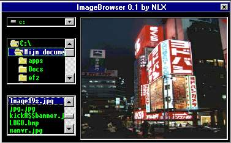



## ImageView 0\.1

### Description

It views *.jpg , *.bmp , *.gif , *.ico and *.wmf with the littlest amount of coding !

Yeah i know that its simple as hell , but people need to start with the basics of the controls first i think !
 
### More Info
 

             |
---                |---
**Submitted On**   |2001-01-10 00:42:20
**By**             |[NorthernLight](https://github.com/Planet-Source-Code/PSCIndex/blob/master/ByAuthor/northernlight.md)
**Level**          |Beginner
**User Rating**    |4.0 (16 globes from 4 users)
**Compatibility**  |VB 5\.0, VB 6\.0
**Category**       |[Graphics](https://github.com/Planet-Source-Code/PSCIndex/blob/master/ByCategory/graphics__1-46.md)
**World**          |[Visual Basic](https://github.com/Planet-Source-Code/PSCIndex/blob/master/ByWorld/visual-basic.md)
**Archive File**   |[CODE\_UPLOAD13592192001\.zip](https://github.com/Planet-Source-Code/northernlight-imageview-0-1__1-14290/archive/master.zip)

